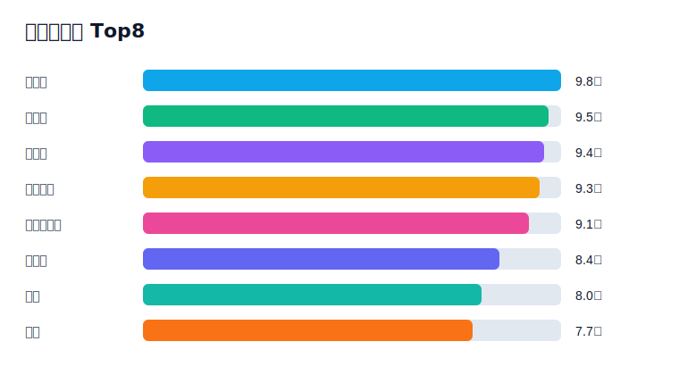
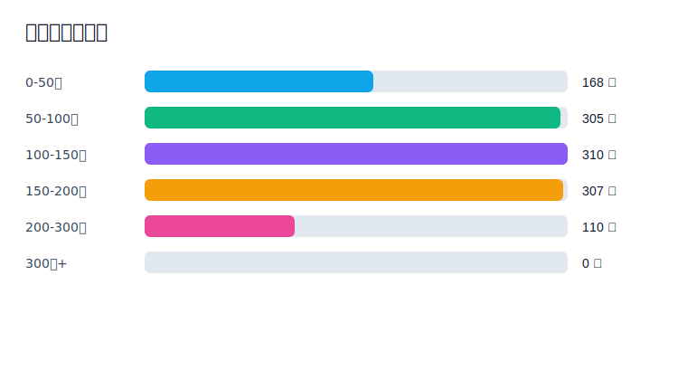
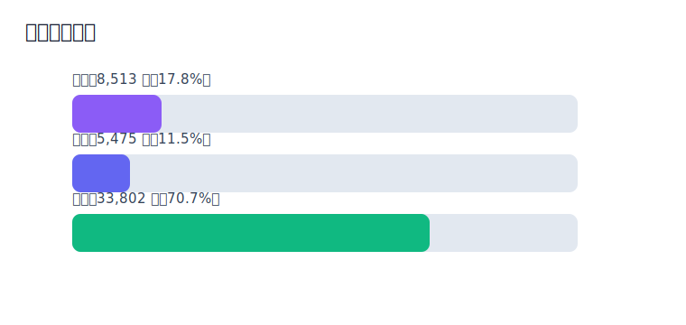
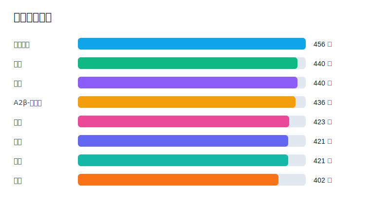

# 常温牛奶电商数据挖掘与可视化分析

> 项目状态：活跃维护。该项目不是 LTS 项目，后续会继续补充截图、数据导入说明、部署说明和分析模型说明。

本项目是一个基于 Django 的常温牛奶电商数据分析系统，围绕商品、品牌、价格段、产品属性、评论情感和用户行为做统计分析与可视化展示。项目使用 SQLite 默认数据库，适合作为课程设计、毕业设计、数据分析看板和二次开发案例。

项目流程：

```text
演示数据采集/导入 -> 商品与评论入库 -> 分析 API 聚合 -> ECharts 页面展示 -> 后台管理维护
```

## 项目亮点

- 市场概览：总销售额、总销量、品牌集中度 CRn、平台销售额占比
- 品牌价格：品牌销量排名、销售额对比、主流价格区间分析
- 属性偏好：有机、高钙、A2β-酪蛋白、进口奶源等属性频次与共现
- 评论情感：情感极性、评分分布、主题关注统计
- 用户分群：基于消费金额、购买次数、品牌多样性的 K-Means 聚类
- 数据链路：内置模拟数据、离线演示采集页、数据导出命令
- 可视化：Django 模板 + ECharts，图表脚本与页面分离

## 技术栈

| 类型 | 技术 |
| --- | --- |
| 后端 | Python 3.12, Django 4.2 |
| 后台 | django-simpleui, Django Admin |
| 数据库 | SQLite，后续可替换 MySQL |
| 数据分析 | pandas, numpy, scikit-learn |
| 评论处理 | jieba, snownlp |
| 爬虫解析 | requests, beautifulsoup4, scrapy |
| 可视化 | ECharts, Bootstrap |

## 演示图表

以下 SVG 图表根据当前演示数据库生成，用于 README 预览。后续可以把真实页面截图继续放到 `docs/images/`。

### 品牌销售额 Top8



### 价格段商品分布



### 评论情感分布



### 产品属性偏好



## 本地运行

### 1. 克隆项目

```bash
git clone https://github.com/TreasureLZ/Milk_Analysis.git
cd Milk_Analysis
```

### 2. 创建虚拟环境

```bash
python -m venv .venv
```

Windows 激活：

```powershell
.venv\Scripts\activate
```

### 3. 安装依赖

```bash
pip install -r requirements.txt
```

### 4. 初始化数据库

```bash
python manage.py migrate
```

项目当前保留本地演示数据库，重新维护时也可以用命令生成数据：

```bash
python manage.py load_mock_data --clear
```

也可以使用本地演示采集页生成少量可追溯数据：

```bash
python manage.py crawl_demo_data --clear
```

### 5. 启动项目

```bash
python manage.py runserver
```

访问地址：

```text
http://127.0.0.1:8000/
```

后台地址：

```text
http://127.0.0.1:8000/admin/
```

如果没有后台管理员账号，可以执行：

```bash
python manage.py createsuperuser
```

## 常用命令

| 命令 | 说明 |
| --- | --- |
| `python manage.py check` | 检查 Django 配置 |
| `python manage.py load_mock_data --clear` | 重新生成模拟商品、评论、用户行为 |
| `python manage.py crawl_demo_data --clear` | 从本地 HTML 演示页采集入库 |
| `python manage.py export_project_data --format csv` | 导出数据库表到 CSV |
| `python scripts/generate_readme_charts.py` | 基于当前数据库重生成 README SVG 图表 |

## 项目结构

```text
Milk_Analysis/
├── analysis/                 # 分析 API，返回 ECharts 所需 JSON
├── config/                   # Django 项目配置
├── core/                     # 商品、属性、评论、用户行为模型
├── crawler/                  # 本地演示采集页与导入命令
├── docs/                     # 维护说明、截图清单、故障排查
├── scripts/                  # 辅助脚本，例如 README 图表生成
├── templates/                # 基模板与可视化页面模板
├── visualization/            # 页面视图、URL、静态 JS 与 ECharts 资源
├── manage.py
└── requirements.txt
```

## 开发与维护

该项目处于活跃维护状态，后续建议优先补充：

- 前台核心页面截图
- 后台数据管理截图
- MySQL 配置示例
- 数据采集字段说明
- API 接口说明
- 部署说明
- 更完整的情感分析和聚类评估说明

维护计划见：[docs/MAINTENANCE.md](docs/MAINTENANCE.md)

截图补充建议见：[docs/SCREENSHOTS.md](docs/SCREENSHOTS.md)

常见问题见：[docs/TROUBLESHOOTING.md](docs/TROUBLESHOOTING.md)

原始项目说明见：[docs/project-overview.md](docs/project-overview.md)

## 总入口

更多数据分析与可视化项目见：

[Django_Collection](https://github.com/TreasureLZ/Django_Collection)
